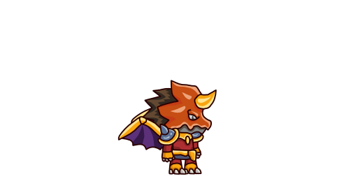
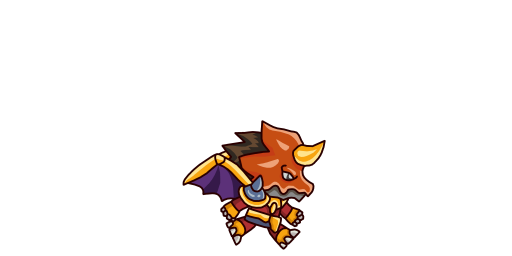
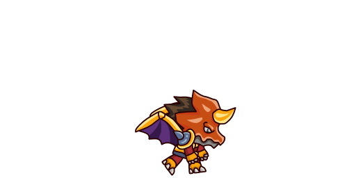

# 🎮 2D Platformer Game

A Unity-based 2D platformer game featuring dynamic combat, enemy AI, and multiple levels. This project demonstrates various game development concepts including player movement, combat systems, enemy behavior, and level design.

## 📸 Game Screenshots

<div align="center">
  
  
  
</div>

*Gameplay screenshots showing player idle, walking, and attack animations*

## 🎯 Game Overview

This is a 2D side-scrolling platformer where players control a character that can move, jump, and attack enemies with fireball projectiles. The game features multiple levels with increasing difficulty, various enemy types, and environmental hazards.

## ✨ Features

### 🎮 Player System
- **Smooth Movement**: Horizontal movement with acceleration and deceleration
- **Advanced Jumping**: Ground jumping and wall jumping mechanics
- **Combat System**: Fireball projectile attacks with cooldown system
- **Health System**: Player health with visual health bar and damage feedback
- **Invulnerability Frames**: Temporary invincibility after taking damage with visual flashing effect

### 🤖 Enemy AI
- **Patrol Behavior**: Enemies patrol between defined points with idle states
- **Detection System**: Enemies can detect and follow the player within range
- **Combat AI**: Enemies attack when player is in sight with cooldown system
- **Multiple Enemy Types**: 
  - Patrol enemies with basic movement
  - Range-following enemies that chase the player
  - Sideways moving trap enemies

### 🏗️ Level Design
- **Multiple Levels**: Level 1, Level 2, and Level 3 with increasing complexity
- **Room System**: Connected rooms with door transitions
- **Camera Control**: Smooth camera following with room transitions
- **Enemy Spawning**: Dynamic enemy spawning system with configurable spawn areas

### 🎨 Visual & Audio
- **Animation System**: Smooth character and enemy animations
- **Sprite-based Graphics**: Pixel art style with parallax backgrounds
- **Health Bar UI**: Visual health display
- **Audio Integration**: Background music and sound effects

### ⚡ Game Mechanics
- **Physics-based Movement**: Realistic physics with gravity and collision detection
- **Projectile System**: Fireball projectiles with explosion effects
- **Trap System**: Environmental hazards like saws and spikes
- **Layer-based Collision**: Proper collision detection between different game objects

## 🎮 Controls

| Action | Control |
|--------|---------|
| **Move Left/Right** | A/D or Arrow Keys |
| **Jump** | Space |
| **Attack** | Left Mouse Button |
| **Wall Jump** | Space (when touching wall) |

## 🏗️ Project Structure

```
Assets/
├── Animation/           # Character and enemy animations
│   ├── Enemy/          # Enemy attack and movement animations
│   ├── Fireball/       # Projectile animations
│   ├── Player/         # Player movement and attack animations
│   └── Traps/          # Trap animations
├── Prefabs/            # Reusable game objects
│   ├── Enemy Prefabs/  # Enemy game objects
│   ├── Traps prefabs/  # Hazard objects
│   └── FireBall Holder.prefab
├── Scenes/             # Game levels
│   ├── Level1.unity    # First level
│   ├── Level2.unity    # Second level
│   └── Main.unity      # Main menu
├── scripts/            # C# game logic
│   ├── Core/           # Core game systems
│   ├── Enemy/          # Enemy AI and behavior
│   ├── Health/         # Health and damage systems
│   ├── Player/         # Player movement and combat
│   ├── Rooms/          # Level and room management
│   └── Traps/          # Environmental hazards
└── sprites/            # Game art assets
```

## 🔧 Technical Implementation

### Core Systems

#### Player Movement (`PlayerMovement.cs`)
- Physics-based movement using Rigidbody2D
- Ground and wall detection using raycasting
- Wall jumping mechanics
- Smooth acceleration and deceleration

#### Combat System (`PlayerAttack.cs`)
- Fireball projectile spawning
- Attack cooldown management
- Direction-based projectile firing

#### Health System (`Health.cs`)
- Damage handling with invulnerability frames
- Visual feedback (sprite flashing)
- Death state management
- Health restoration capabilities

#### Enemy AI
- **Patrol System** (`EnemyPatrol.cs`): Automated movement between patrol points
- **Detection System** (`EnemyRange.cs`): Player detection and following
- **Combat AI** (`Attack1.cs`): Attack patterns and damage dealing

#### Camera System (`CameraController.cs`)
- Smooth player following
- Room transition support
- Look-ahead functionality for better gameplay

### Key Scripts

- `EnemySpawner.cs`: Dynamic enemy spawning in defined areas
- `Projectile.cs`: Fireball projectile behavior and collision
- `Door.cs`: Room transition system
- `Enemy_Sideways.cs`: Moving trap implementation
- `Healthbar.cs`: UI health display

## 🎨 Art Assets

The game uses various sprite packs including:
- **Dragon Warrior Files**: Character sprites and animations
- **Pixel Adventure 1**: Background and terrain assets
- **Grassy Mountains Parallax**: Background layers
- **Custom UI Elements**: Health bars and interface elements

## 🚀 Getting Started

### Prerequisites
- Unity 2022.3 LTS or later
- Basic knowledge of Unity Editor

### Installation
1. Clone or download this repository
2. Open the project in Unity Hub
3. Open the `Main.unity` scene to start from the main menu
4. Or open `Level1.unity` to jump directly into gameplay

### Building
1. Go to `File > Build Settings`
2. Add the scenes you want to include
3. Select your target platform
4. Click `Build` to create an executable

## 🎯 Game Objectives

- Navigate through multiple levels
- Defeat enemies using fireball attacks
- Avoid environmental hazards
- Complete each level by reaching the end

## 🔮 Future Enhancements

Potential improvements and additions:
- Power-ups and collectibles
- Boss battles
- More enemy types
- Sound effects and music
- Save/load system
- Mobile controls support
- Multiplayer features

## 📝 Development Notes

This project demonstrates:
- Object-oriented programming in Unity
- Physics-based game mechanics
- AI behavior implementation
- Animation system integration
- UI system development
- Level design principles

## 🤝 Contributing

Feel free to contribute to this project by:
- Reporting bugs
- Suggesting new features
- Improving documentation
- Adding new levels or enemies

## 📄 License

This project is open source and available under the [MIT License](LICENSE).

---

**Happy Gaming! 🎮**
 
